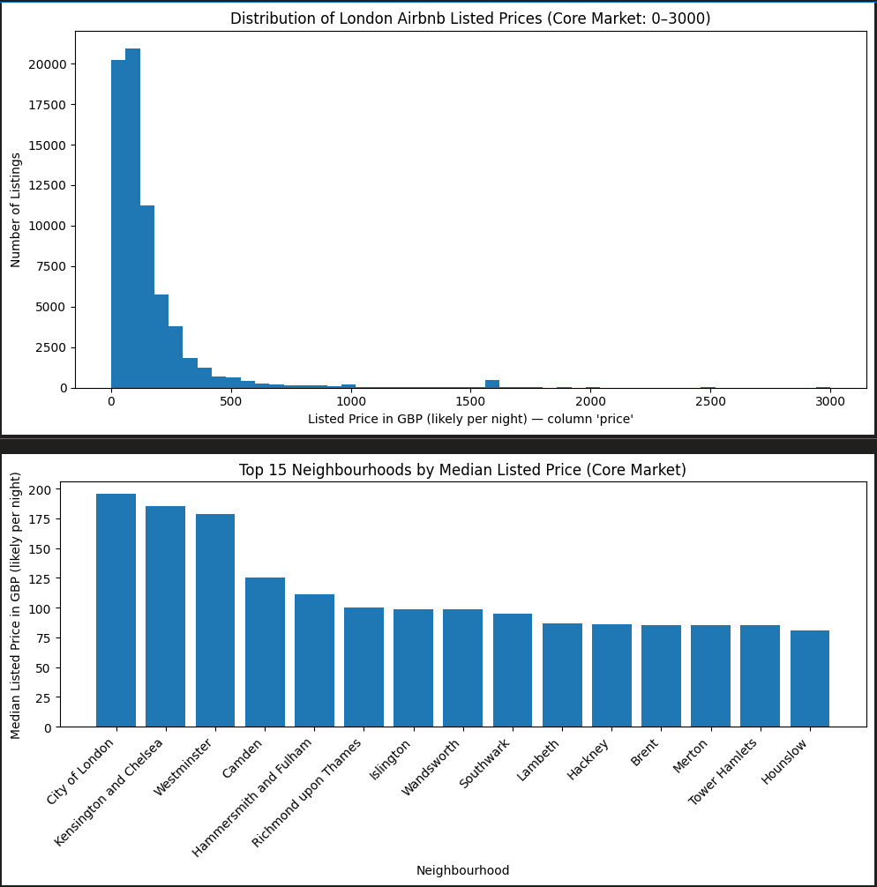

# London AirBnB — Exploratory Data Analysis (Python)

## Project Context
This project was completed during **Week 6 (Python – Exploratory Data Analysis)** of the Data Technician Skills Bootcamp, specifically as part of the **Day 4 analytical tasks**.

The week focused on applying Python libraries to real-world datasets, structuring exploratory analysis, and communicating findings clearly through both code and written outputs.

---

## Purpose
The purpose of this project was to explore the **London AirBnB listings dataset** using Python in order to:

- Understand pricing patterns across London neighbourhoods  
- Compare listing types and their impact on price  
- Practise structured, question-led exploratory data analysis  
- Translate numerical results into clear, interpretable insights  

The task emphasised analytical thinking and clarity of communication rather than advanced modelling.

---

## Dataset Overview
The primary dataset used in this project is:

- **London_AIRBNB.xlsx**

This dataset contains information on AirBnB listings across London, including attributes such as:

- Neighbourhood / location
- Listing type (e.g. entire home, private room)
- Price
- Availability and review-related fields

The dataset was treated as a realistic example of semi-structured data commonly encountered in analysis tasks.

---

## Task Overview
The core task was to:

1. Load and inspect the dataset using **Pandas**
2. Explore distributions, groupings, and summary statistics
3. Answer a set of **defined analytical questions**
4. Support findings with clear numerical outputs
5. Ensure the analysis was reproducible and well-documented

The work was completed in a Jupyter Notebook format.

---

## How the Task Was Met
To meet the task requirements, I:

- Used **Pandas** for data loading, cleaning, grouping, and aggregation
- Applied **NumPy** where appropriate for numerical calculations
- Used **Matplotlib** for visual exploration where useful
- Structured the analysis around clearly stated questions
- Included comments and explanations to clarify analytical intent

Rather than presenting raw tables alone, results were expressed as readable statements to reflect how insights are typically communicated to non-technical stakeholders.

---

## Going Beyond the Core Requirements
In addition to the base task, I:

- Structured the notebook around **10 explicit analytical questions**, mirroring real-world stakeholder queries
- Ensured all insights were **numerically justified**, avoiding vague or generic statements
- Added helper formatting (e.g. currency-style outputs) to improve readability
- Organised the analysis so outputs could be easily reused in reports or presentations

This approach helped bridge the gap between technical exploration and business-facing insight.

---

## Repository Structure

London AirBNB/
│
├── datasets.ipynb
├── Day 4 Task 1/
│ └── Day 4 Task 1.ipynb
│
├── Day 4 Task 2/
│ ├── London_AIRBNB.xlsx
│ ├── AIRBNB.xlsx
│ ├── Apprenticeship_Data.xlsx
│ ├── Book_Sales.xlsx
│ ├── Data_Science_Jobs.xlsx
│ ├── Happiness.xlsx
│ └── NHS_Jobs.xlsx

This repository focuses on the **London AirBnB analysis**, which forms part of the wider Day 4 dataset exploration.

---

## Tools & Technologies
- Python  
- Pandas  
- NumPy  
- Matplotlib  
- Jupyter Notebook  

---

## Key Takeaway
This project demonstrates my ability to:

- Conduct structured exploratory data analysis
- Ask meaningful questions of a dataset
- Produce clear, interpretable insights from raw data
- Write readable, well-documented analytical code

---

## Next Steps
Possible extensions to this analysis could include:

- Time-based availability analysis
- Deeper geographic comparisons
- Preparing insights for a dashboard or report format